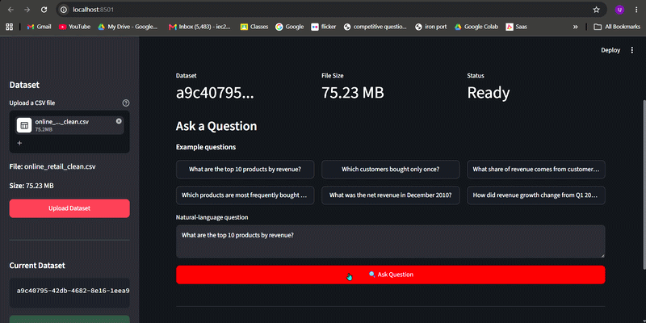

# Natural Language Insights Engine

A natural-language analytics engine that lets users upload an arbitrary CSV dataset and ask analytical questions in plain English.

The system dynamically profiles the uploaded dataset, stores it in DuckDB, translates natural-language questions into a structured analytical plan using Gemini, generates SQL deterministically, validates the SQL, executes it, and returns a grounded answer.

The design intentionally keeps the LLM out of SQL generation and numerical calculation to improve correctness, safety, and reproducibility.

---


## 1. Overview

### Problem

Business users often have data in CSV files but need technical knowledge of SQL to answer questions such as:

* What are the top 10 products by revenue?
* How did revenue change from Q1 to Q2?
* What was the revenue in a particular month?
* Which customers bought only once?
* What percentage of revenue came from one-time customers?
* Which products were most frequently bought together?

The goal of this project is to make those questions answerable using natural language without requiring users to write SQL.

### Solution

The application provides:

* CSV upload
* Automatic schema and semantic profiling
* DuckDB-based analytical storage
* Natural-language question answering
* Structured LLM planning
* Deterministic SQL generation
* SQL validation and guardrails
* Asynchronous ingestion and query jobs
* API endpoints
* Swagger/OpenAPI documentation
* Streamlit UI
* Automated tests
* CI-ready test execution

---

# 2. Architecture

```text
                         ┌─────────────────┐
                         │   CSV Upload    │
                         └────────┬────────┘
                                  │
                                  ▼
                    ┌─────────────────────────┐
                    │ Schema Profiler         │
                    │                         │
                    │ • Column names          │
                    │ • Data types             │
                    │ • Null counts            │
                    │ • Cardinality            │
                    │ • Semantic roles         │
                    └────────────┬────────────┘
                                 │
                                 ▼
                    ┌─────────────────────────┐
                    │ DuckDB Dataset           │
                    │ + Profile Metadata       │
                    └────────────┬────────────┘
                                 │
                                 │
                      Natural Language Question
                                 │
                                 ▼
                    ┌─────────────────────────┐
                    │ Capability Check         │
                    │                         │
                    │ Deterministic refusal   │
                    │ for unsupported metrics │
                    └────────────┬────────────┘
                                 │
                                 ▼
                    ┌─────────────────────────┐
                    │ Gemini Planner            │
                    │                         │
                    │ NL → QueryPlan          │
                    │                         │
                    │ No SQL                  │
                    │ No calculation          │
                    └────────────┬────────────┘
                                 │
                                 ▼
                    ┌─────────────────────────┐
                    │ Deterministic SQL        │
                    │ Generator                │
                    └────────────┬────────────┘
                                 │
                                 ▼
                    ┌─────────────────────────┐
                    │ SQL Guardrails           │
                    │                         │
                    │ SQLGlot                 │
                    │ SELECT-only             │
                    │ Table validation         │
                    │ Column validation        │
                    └────────────┬────────────┘
                                 │
                                 ▼
                    ┌─────────────────────────┐
                    │ DuckDB Execution         │
                    └────────────┬────────────┘
                                 │
                                 ▼
                    ┌─────────────────────────┐
                    │ Grounded Answer         │
                    │                         │
                    │ Deterministic formatter │
                    └─────────────────────────┘
```

---

# 3. Key Design Principle

The most important architectural decision is:

> **The LLM plans the analysis; deterministic application code generates and executes the SQL.**

The system does **not** ask Gemini to:

* generate SQL
* calculate numerical results
* invent columns
* invent metrics
* produce the final numerical answer

Instead:

```text
User question
      ↓
Gemini
      ↓
Structured QueryPlan
      ↓
Deterministic SQL generator
      ↓
SQL validation
      ↓
DuckDB
      ↓
Deterministic answer
```

This separates **language understanding** from **data execution**.

---

# 4. Why This Architecture?

A fully LLM-generated SQL approach would be simpler initially but introduces several risks:

* hallucinated column names
* invalid SQL
* incorrect aggregations
* accidental access to unintended tables
* inconsistent numerical calculations
* difficulty testing correctness
* difficult-to-control refusal behavior

The current architecture limits the LLM's responsibility to semantic interpretation.

For example, Gemini may produce:

```json
{
  "answerable": true,
  "question_type": "ranking",
  "measure_column": "line_revenue",
  "dimension_columns": ["description"],
  "aggregation": "sum",
  "sort_direction": "desc",
  "limit": 10
}
```

The application then deterministically converts this plan into SQL.

---

# 5. Tech Stack

| Component           | Technology     |
| ------------------- | -------------- |
| Language            | Python         |
| API                 | FastAPI        |
| Analytical database | DuckDB         |
| LLM                 | Google Gemini  |
| LLM SDK             | `google-genai` |
| Data profiling      | DuckDB         |
| SQL validation      | SQLGlot        |
| UI                  | Streamlit      |
| Validation          | Pydantic       |
| Testing             | Pytest         |
| Package management  | uv             |
| CI                  | GitHub Actions |

---

# 6. Project Structure

```text
natural-language-insights/
│
├── app/
│   ├── api/
│   │   ├── datasets.py
│   │   ├── health.py
│   │   ├── jobs.py
│   │   └── questions.py
│   │
│   ├── ingestion/
│   │   ├── loader.py
│   │   ├── profiler.py
│   │   ├── registry.py
│   │   └── schema_context.py
│   │
│   ├── jobs/
│   │   └── manager.py
│   │
│   ├── models/
│   │   └── schemas.py
│   │
│   ├── query/
│   │   ├── answer.py
│   │   ├── executor.py
│   │   ├── planner.py
│   │   ├── sql_generator.py
│   │   └── validator.py
│   │
│   └── main.py
│
├── tests/
│   ├── test_health.py
│   ├── test_jobs.py
│   ├── test_loader.py
│   ├── test_profiler.py
│   └── test_upload.py
│
├── ui/
│   └── ui.py
│
├── data/
│   ├── db/
│   └── profiles/
│
├── .env
├── .gitignore
├── pyproject.toml
└── README.md
```

---

# 7. Setup

## Requirements

Recommended environment:

* Python 3.12+
* `uv`
* Gemini API key

The project uses `uv` for dependency management.

---

## Install dependencies

From the project root:

```bash
uv sync
```

For development and testing:

```bash
uv sync --dev
```

---

# 8. Environment Variables

Create a `.env` file in the project root:

```text
GEMINI_API_KEY=YOUR_GEMINI_API_KEY
GEMINI_MODEL=gemini-3.7-flash
```

Do not commit `.env` or the API key to source control.

---

# 9. Run the Application

The application has two components:

1. FastAPI backend
2. Streamlit frontend

## Terminal 1 — Start API

```bash
uv run uvicorn app.main:app --reload
```

The API will be available at:

```text
http://127.0.0.1:8000
```

---

## Terminal 2 — Start UI

```bash
uv run python -m streamlit run ui/ui.py
```

The Streamlit UI will open in the browser.

---

# 10. Swagger API Documentation

FastAPI automatically provides interactive API documentation.

Open:

```text
http://127.0.0.1:8000/docs
```

The Swagger interface can be used to:

* upload CSV files
* inspect job status
* submit analytical questions
* inspect structured responses
* test validation and error handling

---

# 11. API Flow

## Step 1 — Upload CSV

```http
POST /datasets
```

The upload endpoint:

1. validates the filename
2. validates the CSV extension
3. stores the file
4. creates an asynchronous ingestion job
5. returns a dataset ID and job ID

Example response:

```json
{
  "job_id": "example-job-id",
  "dataset_id": "example-dataset-id",
  "filename": "sales.csv",
  "status": "queued",
  "size_bytes": 12345
}
```

The endpoint returns:

```text
202 Accepted
```

because ingestion continues asynchronously.

---

# 12. Job Status

```http
GET /jobs/{job_id}
```

A job can have states such as:

```text
queued
running
completed
failed
```

Example:

```json
{
  "job_id": "example-job-id",
  "status": "completed",
  "result": {}
}
```

Failed jobs return a structured error:

```json
{
  "job_id": "example-job-id",
  "status": "failed",
  "error": {
    "code": "JOB_FAILED",
    "message": "..."
  }
}
```

Unknown jobs return:

```text
404 Not Found
```

---

# 13. Asking Natural-Language Questions

Questions are submitted using the question endpoint.

```http
POST /questions
```

Example request:

```json
{
  "dataset_id": "example-dataset-id",
  "question": "What are the top 10 products by revenue?"
}
```

The question is processed asynchronously.

The API returns a job ID which can then be polled through:

```http
GET /jobs/{job_id}
```

---

# 14. Supported Analytical Questions

The system supports several general analytical patterns.

## 14.1 Top N by a measure

Example:

```text
What are the top 10 products by revenue?
```

The planner identifies:

* product dimension
* revenue measure
* sum aggregation
* descending ranking
* limit = 10

---

## 14.2 Period comparison

Example:

```text
How did revenue growth change from Q1 2011 to Q2 2011 by country?
```

The planner identifies:

* country dimension
* date column
* revenue measure
* first period
* second period

The SQL generator calculates:

```text
Period 1 value
Period 2 value
Absolute change
Growth percentage
```

---

## 14.3 Monthly revenue

Example:

```text
What was the net revenue in December 2011?
```

The planner identifies:

* date column
* revenue measure
* requested date range

The SQL generator calculates the requested aggregate.

The system does not invent discounts, taxes, returns, or other deductions when those fields are unavailable.

---

## 14.4 One-time customers

Example:

```text
Which customers bought only once?
```

The system identifies:

* customer identifier
* order identifier, when available

and determines which customers have exactly one purchase/order.

---

## 14.5 Revenue share

Example:

```text
What share of revenue came from customers who bought only once?
```

The query uses:

```text
One-time customer revenue
------------------------- × 100
Total revenue
```

The calculation is performed by DuckDB, not by the LLM.

---

## 14.6 Product pairs

Example:

```text
Which products were bought together most frequently?
```

The system:

1. identifies the product column
2. identifies the order column
3. creates unique products per order
4. creates product pairs
5. counts pair frequency
6. ranks the pairs

---

# 15. Dynamic Schema Understanding

The system is designed for arbitrary CSV files rather than a fixed schema.

During ingestion, the profiler discovers:

* column names
* logical data types
* row count
* distinct count
* null count
* semantic role

Example profile:

```json
{
  "row_count": 1000,
  "column_count": 5,
  "columns": [
    {
      "name": "customer_id",
      "type": "VARCHAR",
      "role": "identifier"
    },
    {
      "name": "order_date",
      "type": "DATE",
      "role": "date_or_time"
    },
    {
      "name": "country",
      "type": "VARCHAR",
      "role": "categorical"
    },
    {
      "name": "revenue",
      "type": "DOUBLE",
      "role": "numeric_measure"
    }
  ]
}
```

The planner receives this schema context before interpreting the question.

This prevents the planner from assuming that the uploaded data follows a predefined schema.

---

# 16. Handling Unanswerable Questions

A key requirement is that the system should **refuse questions that cannot be reliably answered**.

Examples:

### Missing customer identifier

Question:

```text
Which customers bought only once?
```

If the dataset has no customer identifier, the system refuses rather than guessing.

---

### Missing revenue measure

Question:

```text
What was the revenue last month?
```

If there is no suitable revenue/value measure, the system refuses.

---

### Profit without sufficient data

Question:

```text
What was the profit margin?
```

If the dataset contains neither:

```text
profit
```

nor enough information such as:

```text
revenue + cost
```

the system refuses.

---

### Unsupported concepts

If the user asks for a metric that cannot be reliably derived from the available schema, the system returns a refusal instead of hallucinating an answer.

---

# 17. Guardrails

The system uses multiple layers of protection.

## Layer 1 — Pydantic request validation

The API validates:

* dataset ID
* question presence
* question length

---

## Layer 2 — Capability checks

Certain obviously unsupported questions are rejected before calling the LLM.

This reduces unnecessary API calls and improves predictable refusal behavior.

---

## Layer 3 — Structured LLM output

Gemini is constrained to return a `QueryPlan`.

The planner is instructed to:

* use only available columns
* never invent columns
* never invent metrics
* never write SQL
* never calculate answers
* refuse when schema information is insufficient

---

## Layer 4 — Deterministic SQL generation

SQL is produced by application code from the validated `QueryPlan`.

The LLM never directly controls SQL.

---

## Layer 5 — SQLGlot validation

Generated SQL is parsed and validated before execution.

The validator checks:

* exactly one SQL statement
* `SELECT` only
* authorized table
* authorized columns
* forbidden write operations

Operations such as:

```sql
INSERT
UPDATE
DELETE
DROP
CREATE
ALTER
```

are rejected.

---

# 18. Async Processing

Both ingestion and question processing use asynchronous jobs.

The current implementation uses an in-process:

```text
ThreadPoolExecutor
```

with a bounded worker pool.

The flow is:

```text
Request
   ↓
Create job ID
   ↓
queued
   ↓
running
   ↓
completed / failed
```

This prevents long-running CSV profiling, ingestion, or analytical queries from blocking the HTTP request.

---

# 19. Concurrency and Partial Failure

The job manager supports multiple jobs through a bounded worker pool.

Each job has independent state:

```text
Job A → completed
Job B → running
Job C → failed
Job D → queued
```

A failure in one job does not automatically terminate other jobs.

For a production deployment, the in-memory job manager could be replaced with a durable queue such as:

```text
Redis + worker processes
```

or:

```text
Celery / RQ / cloud queue
```

and job state could be persisted in a database.

The current implementation intentionally keeps the system lightweight because cloud deployment and distributed infrastructure are outside the assignment scope.

---

# 20. Data Storage

Each uploaded dataset receives a unique dataset ID.

The current storage structure is:

```text
data/
├── <dataset-id>.csv
│
├── db/
│   └── <dataset-id>.duckdb
│
└── profiles/
    └── <dataset-id>.json
```

DuckDB provides a lightweight analytical engine without requiring a separate database server.

This is well suited to:

* local development
* CSV analytics
* analytical SQL
* fast aggregation
* reproducible queries

---

# 21. UI

The Streamlit interface provides:

* CSV upload
* ingestion status
* dataset readiness state
* natural-language question input
* example questions
* asynchronous query polling
* refusal messages
* final answers
* result tables
* generated SQL
* structured query plan
* job IDs

The UI polls the backend every few seconds while a job is running.

---

# 22. Error Handling

The API uses structured errors instead of exposing Python stack traces.

Examples include:

```json
{
  "detail": {
    "code": "INVALID_FILE_TYPE",
    "message": "Only CSV files are supported."
  }
}
```

Other examples include:

```text
INVALID_FILENAME
FILE_TOO_LARGE
FILE_STORAGE_ERROR
UPLOAD_FAILED
JOB_NOT_FOUND
JOB_FAILED
```

This keeps API responses predictable and easier for clients to consume.

---

# 23. Testing

The project uses Pytest.

Run the full test suite:

```bash
uv run pytest -v
```

The tests cover:

* health endpoint
* successful jobs
* failed jobs
* unknown jobs
* CSV loading
* schema profiling
* CSV upload
* invalid file rejection

The current test suite passes successfully.

---

# 24. Test Strategy

The testing strategy focuses on deterministic components.

### Ingestion

Verify that:

* CSVs load correctly
* row counts are correct
* DuckDB tables are created

### Profiling

Verify that:

* column metadata is discovered
* numeric columns are identified
* date/time columns are identified
* categorical/text fields are handled

### API

Verify:

* valid upload returns `202`
* invalid files return `400`
* unknown jobs return `404`

### Job manager

Verify:

* successful jobs complete
* failed jobs become `failed`
* job IDs can be retrieved

LLM behavior is intentionally isolated from deterministic execution logic so most of the system can be tested without requiring a live LLM call.

---

# 25. CI

The intended CI pipeline runs the test suite automatically for:

* pushes
* pull requests

The CI environment installs dependencies using `uv` and runs:

```bash
uv run pytest -v
```

Coverage can additionally be measured with:

```bash
uv run pytest --cov=app --cov-report=term-missing
```

---

# 26. Important Design Decisions

## Decision 1 — DuckDB instead of a traditional database

### Why

The workload is analytical and starts from CSV files.

DuckDB provides:

* SQL analytics
* fast local execution
* zero database server setup
* easy per-dataset isolation

### Alternative

PostgreSQL could provide stronger transactional and multi-user capabilities, but it introduces operational complexity that is unnecessary for the assignment.

---

## Decision 2 — Structured planner instead of LLM-generated SQL

### Why

A structured intermediate representation provides:

* deterministic SQL generation
* easier validation
* better testing
* lower hallucination risk
* explicit refusal behavior

### Alternative

LLM → SQL directly is simpler but less controllable.

---

## Decision 3 — SQLGlot validation

### Why

String-based SQL checks are fragile.

SQLGlot allows the application to parse the SQL into an abstract syntax tree and inspect its structure.

This makes checks such as:

```text
SELECT only
single statement
authorized table
authorized columns
```

more robust.

---

## Decision 4 — In-memory job manager

### Why

The assignment requires asynchronous behavior but does not require distributed deployment.

An in-process bounded executor provides:

* job IDs
* queueing
* concurrent execution
* status polling
* failure isolation

### Production alternative

A durable job queue and persistent job store would be appropriate for multi-instance deployment.

---

# 27. Limitations

The current implementation intentionally has several limitations.

### In-memory job state

Job state is lost if the API process restarts.

### Local storage

Uploaded CSVs and DuckDB files are stored locally.

### Single-process architecture

The job manager is not designed for multiple API replicas.

### Limited semantic vocabulary

The planner currently supports a defined set of analytical question types.

### No authentication

Authentication and authorization are outside the assignment scope.

### No cloud deployment

The application is designed to run locally.

### No advanced visualization layer

The UI currently focuses on answers and tabular results rather than sophisticated chart generation.

---

# 28. Production Evolution

A production version could evolve toward:

```text
                       ┌───────────────┐
                       │ Load Balancer │
                       └───────┬───────┘
                               │
                 ┌─────────────┴─────────────┐
                 │                           │
          ┌──────▼──────┐             ┌──────▼──────┐
          │ API Worker  │             │ API Worker  │
          └──────┬──────┘             └──────┬──────┘
                 │                           │
                 └─────────────┬─────────────┘
                               │
                         ┌─────▼─────┐
                         │ Job Queue │
                         └─────┬─────┘
                               │
                    ┌──────────▼──────────┐
                    │ Background Workers │
                    └──────────┬──────────┘
                               │
                  ┌────────────┴────────────┐
                  │                         │
             Object Storage           Metadata DB
                  │
               CSV/Data
```

Potential additions:

* object storage
* persistent metadata database
* distributed job queue
* query result caching
* tracing
* metrics
* structured logging
* authentication
* rate limiting
* query timeouts
* resource limits
* semantic layer
* richer visualizations

---

# 29. Evaluation and Guardrails

A useful evaluation suite should contain three categories.

## Answerable questions

Examples:

```text
What are the top 10 products by revenue?
```

```text
What was the revenue in December 2011?
```

```text
Which customers bought only once?
```

Expected behavior:

```text
Return correct result.
```

---

## Unanswerable questions

Examples:

```text
What was the profit?
```

when no profit or cost information exists.

Expected behavior:

```text
Refuse.
```

---

## Ambiguous questions

Examples:

```text
What is the best product?
```

Expected behavior depends on whether "best" can be mapped to an available metric.

If no reliable interpretation exists:

```text
Refuse instead of guessing.
```

The central evaluation principle is:

> **A correct refusal is better than a confidently incorrect answer.**

---

# 30. Security Considerations

The system does not allow arbitrary SQL from the user.

Natural-language input is transformed into a constrained structured plan.

Before execution:

```text
QueryPlan
   ↓
Deterministic SQL
   ↓
SQLGlot parser
   ↓
Table validation
   ↓
Column validation
   ↓
SELECT-only validation
   ↓
DuckDB
```

This reduces the risk of:

* destructive SQL
* unauthorized table access
* unauthorized column access
* multi-statement execution

Additional production protections would include:

* authentication
* authorization
* query timeouts
* memory limits
* file-size limits
* rate limiting
* tenant isolation

---

# 31. Quick Demo

### 1. Start backend

```bash
uv run uvicorn app.main:app --reload
```

### 2. Start UI

```bash
uv run python -m streamlit run ui/ui.py
```

### 3. Upload a CSV

Upload any compatible CSV through the UI.

### 4. Wait for ingestion

The UI polls the ingestion job until:

```text
completed
```

### 5. Ask a question

For example:

```text
What are the top 10 products by revenue?
```

### 6. Inspect the result

The UI displays:

* natural-language answer
* result table
* SQL
* structured query plan
* job status

---

# 32. Example End-to-End Flow

Suppose the uploaded CSV contains:

```text
customer_id
order_id
order_date
country
product
revenue
```

The user asks:

```text
What are the top 10 products by revenue?
```

The system performs:

```text
1. Load dataset
       ↓
2. Profile schema
       ↓
3. Detect product + revenue columns
       ↓
4. Check whether the question is answerable
       ↓
5. Gemini creates QueryPlan
       ↓
6. Deterministic SQL generator creates SQL
       ↓
7. SQLGlot validates SQL
       ↓
8. DuckDB executes SQL
       ↓
9. Deterministic formatter creates answer
       ↓
10. API/UI returns result
```

The LLM never sees or calculates the final result.

---

# 33. Future Improvements

The next development priorities would be:

### 1. Persistent job infrastructure

Move job state from memory to a durable store.

### 2. Query caching

Cache repeated questions based on:

```text
dataset_id + normalized question + dataset version
```

### 3. Observability

Add:

* structured logs
* request IDs
* query latency
* LLM latency
* DuckDB execution time
* failure rates

### 4. Evaluation harness

Build a benchmark containing:

* answerable questions
* unanswerable questions
* ambiguous questions
* expected query plans
* expected results

### 5. Better schema semantics

Introduce a richer semantic layer for:

* measures
* dimensions
* entities
* time fields
* currencies
* units

### 6. Visualization

Automatically recommend charts for suitable analytical questions.

### 7. Follow-up questions

Support conversational queries such as:

```text
What are the top products by revenue?
```

followed by:

```text
Now show me only Germany.
```

This would require maintaining query context safely.

---

# 34. Scope

### Included

* Arbitrary CSV ingestion
* Dynamic schema profiling
* DuckDB analytical storage
* Natural-language analytics
* Structured LLM planning
* Deterministic SQL generation
* SQL validation
* Async jobs
* REST API
* Streamlit UI
* Error handling
* Automated tests

### Out of Scope

* Cloud deployment
* Authentication
* Multi-tenant production infrastructure
* Distributed job processing
* Advanced UI polish
* Enterprise observability infrastructure

---

# 35. Summary

The Natural Language Insights Engine is designed around a simple principle:

> **Use the LLM for language understanding, not for trusted computation.**

The resulting architecture combines:

```text
Natural Language
       +
Schema Awareness
       +
Structured Planning
       +
Deterministic SQL
       +
SQL Guardrails
       +
DuckDB
       +
Asynchronous Jobs
       =
Reliable Natural-Language Analytics
```

This approach provides a practical balance between flexibility and correctness while remaining lightweight enough to run locally and demonstrate end-to-end within the assignment constraints.
